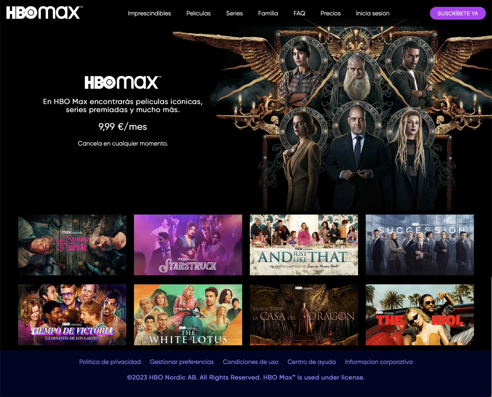

# HBO Website

Recreación de la página web de **HBO Max** realizada como proyecto académico.

> Proyecto realizado previamente para mi titulación de DAW y publicado posteriormente en GitHub como parte de mi portfolio.

## Tecnologías utilizadas

- HTML5
- CSS3

## Características

- Página de inicio inspirada en HBO Max
- Barra de navegación interactiva
- Sección principal con contenido destacado
- Catálogo de películas y series interactivo
- Footer con enlaces informativos

## Captura

## Cómo ejecutar el proyecto

No requiere instalación ni dependencias. Abre `index.html` en un navegador web o a través del link de github pages https://sofirr06.github.io/02_HBO-Website-Recreation/ .

## Nota

Proyecto realizado con fines educativos para la asignatura Lenguaje de Marcas de DAW. No está afiliado a HBO Max ni pretende ser una reproducción oficial de su página web. El contenido y las imágenes se utilizaron con fines educativos.
